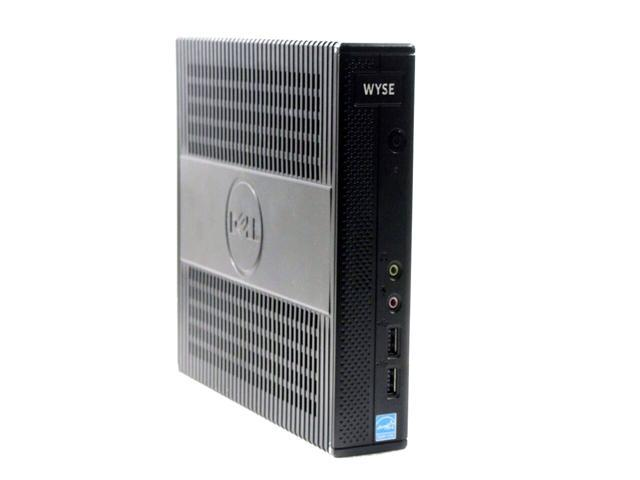

# Dell Wyze

## Specs

**NOTE:** Some of these specs were gotten via the command "sudo lshw" from my ubuntu server that I installed on it's storage module

| Item         | Value              |  
|--------------|--------------------|
| Name         | Dell Wyze          |
| Model Number | Zx0                |
| Spec Sheet   | [link][spec sheet] |
| Memory       | 4 GB DDR3          |
| Storage      | 16 GB SSD          |

### RAM

| Spec         | Value       |
|--------------|-------------|
| Clock        | 1600 MHz    |
| Size         | 4 GB        |
| Vendor       | AMD         |
| Type         | SODIMM DDR3 |

### CPU

| Spec         | Value       |
|:------------:|-------------|
| Name         | AMD G-T56N  |
| Clock        | 100 MHz     |
| Size         | 1650 MHz    |
| Vendor       | AMD         |

## Installing Ubuntu Server

After many unsuccesful attempts at booting the [Ubuntu Server Iso][Ubuntu Server Iso Download] written to a flash drive by [Rufus][Rufus Download]. I found the default bios password for the thin client from [this website][Wyze Zx0 Bios Password] and enabled boot from usb in the bios.

[spec sheet]:https://icecat.biz/en/p/dell+wyse/909740-52l/thin+clients-z90d7-18038133.html

[Wyze Zx0 Bios Password]:https://www.reddingitpro.com/2012/05/08/default-wyse-bios-password/

[Ubuntu Server Iso Download]:https://ubuntu.com/download/server

[Rufus Download]:https://rufus.ie/
