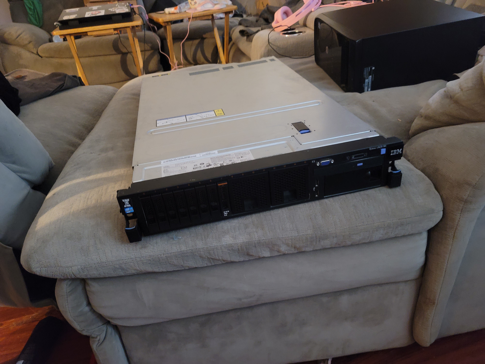
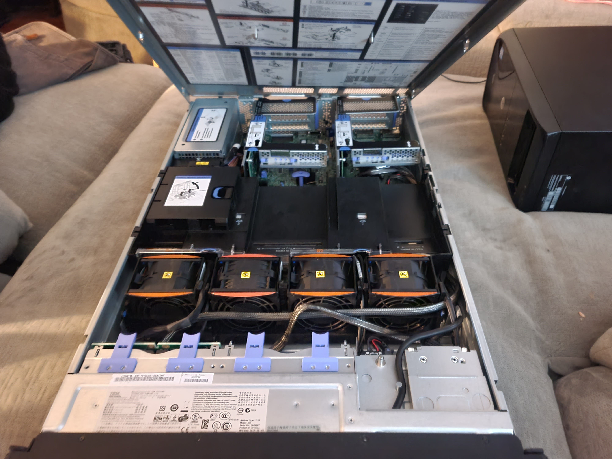

# IBM System x3650 M4

I bought this off of Ebay in May 2021.

[Info Sheet (IBM)](https://www.ibm.com/support/pages/overview-system-x3650-m4-hd-5460)

## Setup

**Main OS :** Fedora 35 (Server Edition)  

**Purpose :**  
    The main purpose of this is to function as a VM Server with it allowing me to virtualize most of my linux boxes (VPN, Git Server, Docker Server, etc) to cut down on the clutter around my lab. 

| VM | |
|----|-|

