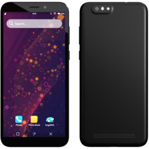
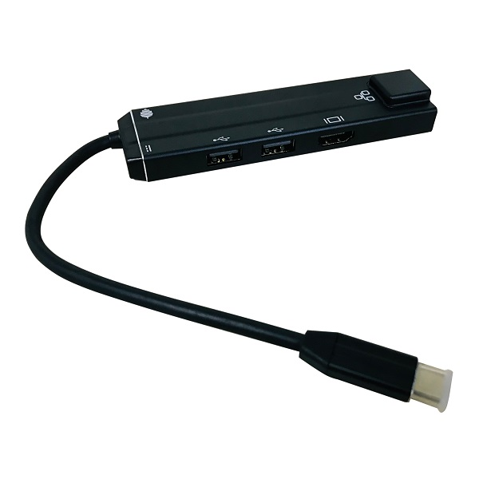

# Pinephone

## Related Pages

- [Pinephone Store Page][pinephone page]
- [Pine64](https://pine64.com)
- [PinePhone Supported OS list][pine64 OS list]

## The Pinephone

Just recently I bought the [PINEPHONE – Beta Edition with Convergence Package][pinephone I bought] from Pine64 because I wanted to try it out and see how well a full Linux OS gets handled by mobile hardware running an ARM Processor.

## Included with Package

1. Pinephone  

  
*(Picture was taken from the store page)*

2. Type-C dock
  
*(Picture was taken from the store page)*

## Specs

| PinePhone |                                                                              |
|:---------:|------------------------------------------------------------------------------|
| CPU       | Allwinner A64 Quad Core SoC                                                  |
| GPU       | Mali 400 MP2 GPU                                                             |
| Screen    | 5.95″ LCD 1440×720, 18:9 aspect ratio (hardened glass)                       |
| RAM       | 3 GB LPDDR3                                                                  |
| Storage   | 32 GB eMMC                                                                   |
| OS        | [Manjaro ARM with Plasma Mobile][manjaro arm listing] (pre-installed)        |

[Spec source](https://kde.org/announcements/plasma-mobile/pinephone-plasma-mobile-edition/)

### My experience with it

**NOTE :** I installed Arch Linux ARM with plasma mobile via [this guide](installing_os_on_pinephone.md).

As I had thought going into this, linux running on this hardware is frightfully slow. At the worst of times it may freeze and may just forcefully reset.

The UI is also suprisingly nice, aside from the occasional bugs.

## Closing Remarks

As I learn more about the phone/do more with the phone I will update this accordingly. I'm quite excited to learn what else I can do with the phone, as well as what projects/systems I can make for it.

[pinephone I bought]: https://pine64.com/product/pinephone-beta-edition-with-convergence-package/

[pinephone page]: https://pine64.com/product-category/pinephone/

[pine64 OS list]: https://wiki.pine64.org/wiki/PinePhone_Software_Releases

[manjaro arm listing]: https://wiki.pine64.org/wiki/PinePhone_Software_Releases#Manjaro_ARM

[arch linux arm listing]: https://wiki.pine64.org/wiki/PinePhone_Software_Releases#Arch_Linux_ARM