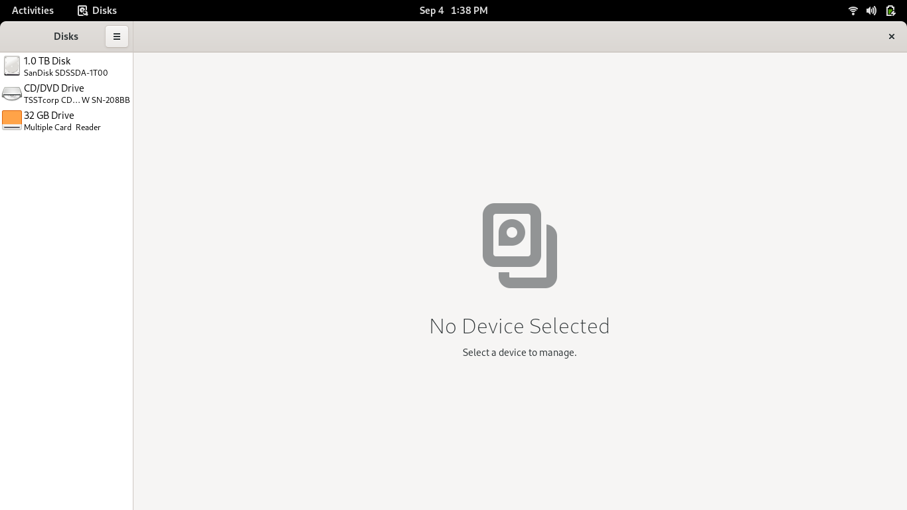
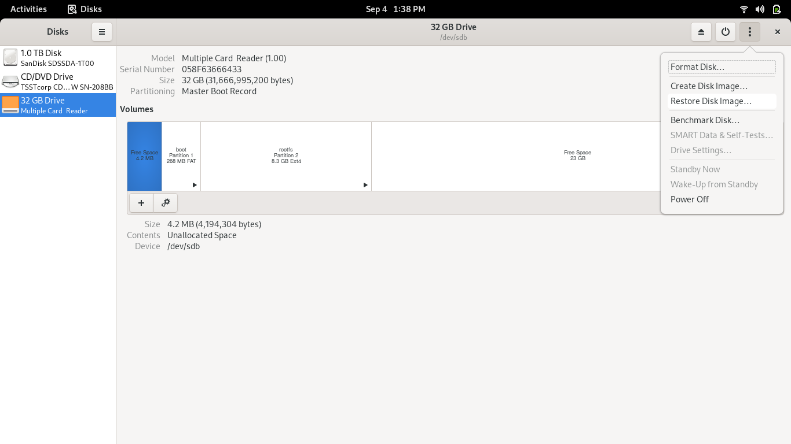
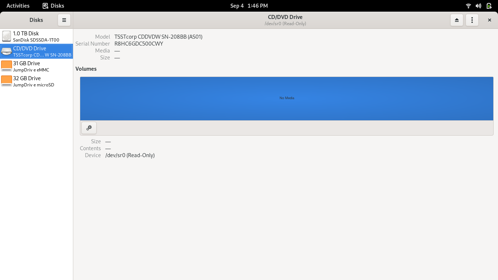

# Installing an OS on the PinePhone

**NOTE :** For those that do not want to do the method I am using to install their OS of choice you can find more methods on Pine64's [guide](https://wiki.pine64.org/index.php/PinePhone_Installation_Instructions) on the topic.

## Items Needed

1. [JumpDrive][JumpDrive GitHub]
2. [Your OS Image of Choice](https://wiki.pine64.org/wiki/PinePhone_Software_Releases)
3. A Program to write your image to the onboard eMMC storage (i.e. [Rufus](https://rufus.ie/) (Windows), [belenaEtcher](https://www.balena.io/etcher/) (Windows/Linux/Mac), etc)
4. A computer to do the writing

### The JumpDrive method

The PinePhone is designed to boot from a micro-sdcard before trying to boot from the onboard storage. So this method takes advantage of this fact. 

#### JumpDrive

Using the JumpDrive image downloaded from [here][JumpDrive GitHub] you can use your program (Gnome Disks in my case).
 

*(Gnome Disks)*

  

Once you have selected a sdcard to write the image to you need to select it and then hit the options button at the top right and choose the JumpDrive image you downloaded.  

 

*(Selecting Restore Disk Image)*

 

Next you need to put the SD Card into the PinePhone and start booting it up. After you do that the screen on the PinePhone should say "JumpDrive is running". If so you should plug up the included type-c data-sync cable to your computer, and it should show as available storage to be written to.  
 

*(Onboard eMMC and SDCard Storage Showing up in Disks)*

## Writing OS onto eMMC Storage

From here the process is rather simple. All there is left to do is to open up whatever software you have to write the image and select the eMMC as you did before and then begin writing the OS to it. 

## Closing Remarks

This process will take between 15-20 minutes. However after that you should have a bootable linux OS running on a mobile device. HAVE FUN!!

[JumpDrive GitHub]: https://github.com/dreemurrs-embedded/Jumpdrive/releases